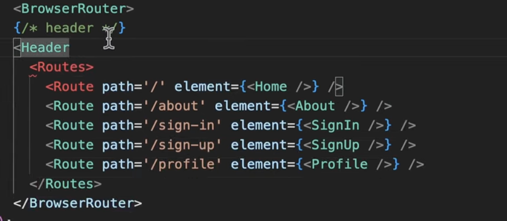
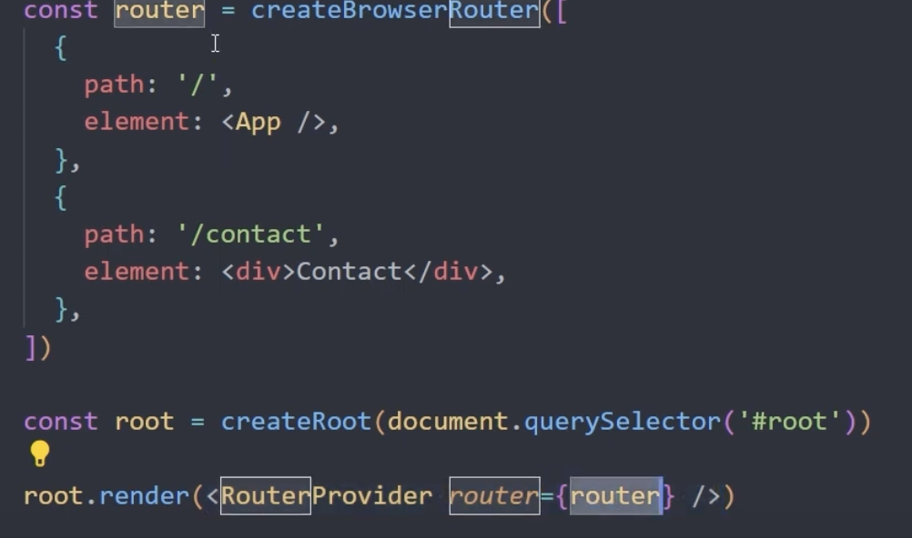

## step1

basic build-- npm create vite@latest client , tailwind install, git init

## step2

create routes and pages

 is done in app.js

 is done in index.js

linking buttons to the pages ie nav bar
using <link>

## step 3
